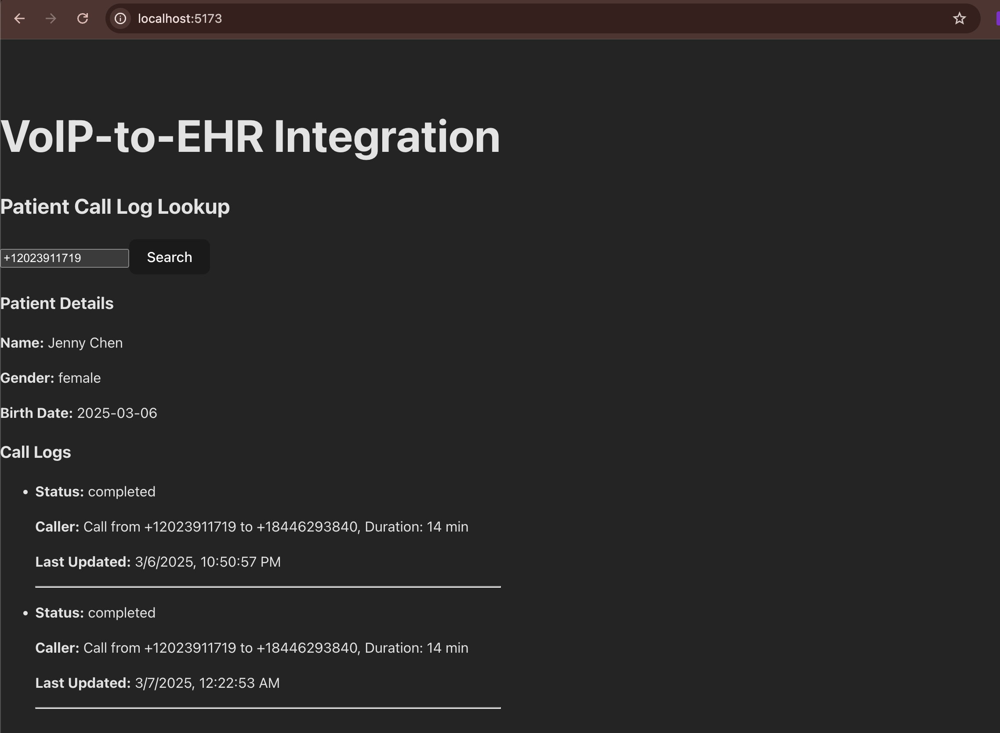

# VoIP-to-EHR Integration

## Project Overview
This project integrates VoIP call logs with an EHR (Electronic Health Record) system using Medplum. It captures call details via Twilio and logs them as `Communication` resources in Medplum's FHIR-based system. A React frontend allows users to search for patients and view call history.

---

## Features
- Capture VoIP call details using Twilio  
- Store patient & call logs in Medplum (FHIR API)  
- Retrieve patient information from Medplum  
- View call history via a React frontend  
- REST API built with FastAPI  

---

## Tech Stack
- **Backend:** FastAPI, Medplum API, Twilio API  
- **Frontend:** React, Axios  
- **VoIP:** Twilio  
- **EHR Storage:** Medplum (FHIR API)  

---

## Setup Instructions

### 1. Clone the Repository
```bash
git clone https://github.com/your-username/voip-ehr-integration.git
cd voip-ehr-integration
```

### 2. Set Up Environment Variables
Create a `.env` file inside the `backend/config` folder and add:
```
TWILIO_ACCOUNT_SID=your_twilio_account_sid
TWILIO_AUTH_TOKEN=your_twilio_auth_token
TWILIO_PHONE_NUMBER=your_twilio_number
EHR_API_URL=https://api.medplum.com/fhir/R4
MEDPLUM_PROJECT_ID=your_medplum_project_id
MEDPLUM_CLIENT_SECRET=your_medplum_client_secret
```

### 3. Install Backend Dependencies
```bash
cd backend
pip install -r requirements.txt
```

### 4. Start the Backend (FastAPI)
```bash
python3 app.py
```

### 5. Install Frontend Dependencies
```bash
cd ../frontend
npm install
```

### 6. Start the Frontend (React)
```bash
npm run dev
```

---

## API Endpoints

### Get Patient Information
- **Endpoint:** `GET /patient/{phone_number}`  
- **Example Request:**
```bash
GET http://localhost:8000/patient/+12023911719
```
- **Response Example:**
   <div style="display: flex; justify-content: center; align-items: center; gap: 10px;">
  
</div>

### Log a VoIP Call
- **Endpoint:** `POST /log_call`
- **Example Request:**
```json
{
  "patient_id": "01956e7f-7a17-7118-a972-bac3fac33723",
  "call_duration": "14",
  "call_status": "completed",
  "caller": "+12023911719",
  "receiver": "+18446293840"
}
```
- **Response Example:**
   <div style="display: flex; justify-content: center; align-items: center; gap: 10px;">
  
</div>

### Retrieve Call Logs
- **Endpoint:** `GET /calls/{patient_id}`
- **Example Request:**
```bash
GET http://localhost:8000/calls/01956e7f-7a17-7118-a972-bac3fac33723
```
- **Response Example (Multiple Logs):**

   <div style="display: flex; justify-content: center; align-items: center; gap: 10px;">
  
</div>

---

## How the Backend Works (FastAPI)

### 1. Fetch Patient Information
- The frontend sends a **GET request** to `/patient/{phone_number}`.
- The backend checks Medplum for a patient matching the **phone number**.
- If a match is found, it returns **patient details**.

### 2. Log a VoIP Call
- When a call occurs, Twilio **captures call details**.
- The backend **logs the call** as a `Communication` resource in Medplum.

   <div style="display: flex; justify-content: center; align-items: center; gap: 10px;">
  
</div>

### 3. Retrieve Call Logs
- The frontend sends a **GET request** to `/calls/{patient_id}`.
- The backend queries **Medplum's FHIR API** to fetch all call logs.
- The logs are returned and displayed on the frontend.

   <div style="display: flex; justify-content: center; align-items: center; gap: 10px;">
  
</div>

---

## How to Test the System
1. **Start the Backend & Frontend**  
   - Run `python3 app.py` (backend)  
   - Run `npm run dev` (frontend)  

2. **Add a Fake Patient in Medplum**  
   - Use Medplum API or UI to manually create a patient.

3. **Simulate a Call**  
   - Use Twilio to make a test call to your **Twilio phone number**.

4. **Check Logs**  
   - Run `GET /calls/{patient_id}` and confirm multiple call logs appear.

5. **Search in the Frontend**  
   - Enter the patient's phone number in the React app.
   - Check if **all call logs appear**.

---

## License
This project is open-source under the MIT License.

